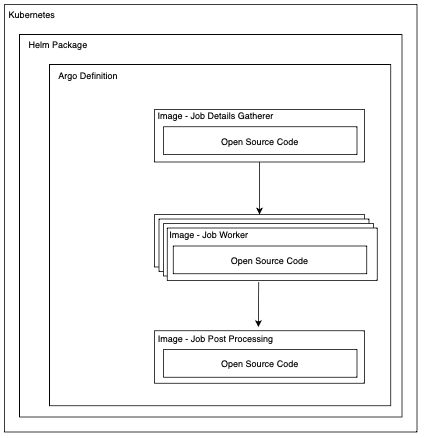

# Focus Converters
Parent repository to hold all common documentation and code samples for all FinOps Foundation managed FOCUS Converter projects.

## Active Converter Projects

* [FOCUS Converter for AWS](https://github.com/finopsfoundation/focus_converter_aws)
* [FOCUS Converter for Azure](https://github.com/finopsfoundation/focus_converter_azure)
* [FOCUS Converter for Google Cloud](https://github.com/finopsfoundation/focus_converter_googlecloud)
* [FOCUS Converter for Oracle Cloud](https://github.com/finopsfoundation/focus_converter_oraclecloud)

## Principles

* **Documentation is most important**
  *Ensure the conversion is not a black box to users*
* **This is an implementation, not The Implementation of a converter**
 *We expect others will implement their own solutions*
* **Support everyone don't favour one maturity level**
 *From basic users with no pre-existing setups through to advanced users wanting to deploy to their own infrastructure*
* **Modular by design, allow replacing parts to best fit the users needs**
 *Avoid a complete rework in order to support one small difference in deployment*

## Converter Project High Level Design

|  |
|:--:|
| *Figure 1 - FOCUS Project High Level Design* |

### Planned Design Elements
* [Terraform](https://www.terraform.io) - *Full stack deployment for those without K8s*
* [Kubernetes](https://kubernetes.io) - *Container Orchestration for Job exection*
* [Helm](https://helm.sh) - *Kubernetes package for deployment onto K8s*
* [Argo](https://argoproj.github.io/argo-workflows/) - *Job Workflow Definition*
* [Images](https://www.docker.com) - *Packaged code into a container image for deployment*
* Code - *The open source code of this project*

In order to adhear to the principle of modular design each layer in the design elements should not have a hard dependancy on the specific implementation of the layer below. By this we mean that you should not have to deploy your Kubernetes cluster using the provided terraform or your Helm package does not need to be deployed onto a specific Kubernetes implementation like (EKS, AKS, etc) and most importantly there would be nothing stopping someone from using the provided source code in their own deployment architecture.

In this first cut design for the converter projects we have three main stages:

The first stage is to assess what needs to be converted and to slice this work up into parts that can be parallel executed. An example of this would be individual files for a file based converter or LIMIT/OFFSETs for a SQL based datastore.

The second stage is a group of parallel executed jobs, each job takes part of the source data and applies the set of rules to convert the format of the input data into FOCUS compatible data.

The last step in the execution will be a post processing step that can join the parts of processed data, load into an output datastore and initialise partitions, etc.

This initial design is likely to be updated and refined as the converter projects progress in development, but ultimatley we would like all converter projects to follow a similar design pattern for ease of use.

The code based loaded into each of these steps will be the same code, but different entrypoints will be supported allowing the different modes of opperations.

If an individual converter project needs to widely deviate from this planned structure then the members of that project should first get community understanding and agreement with the plan before progressing.
